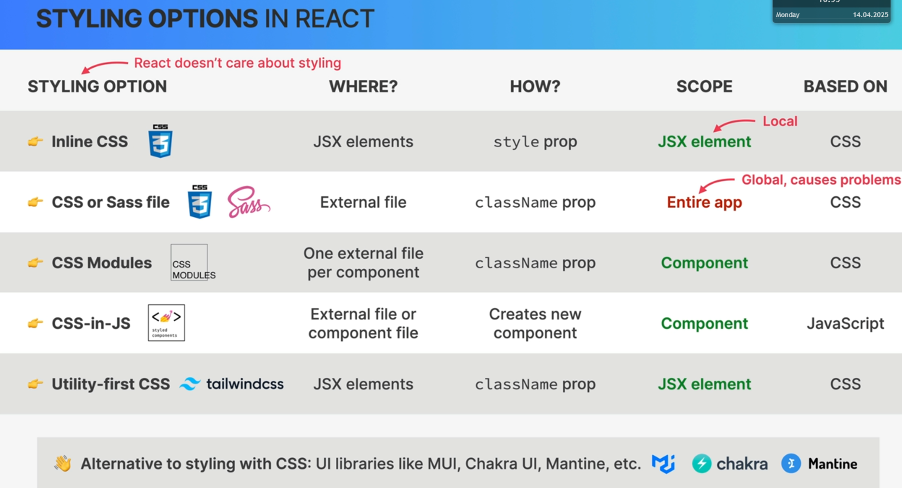
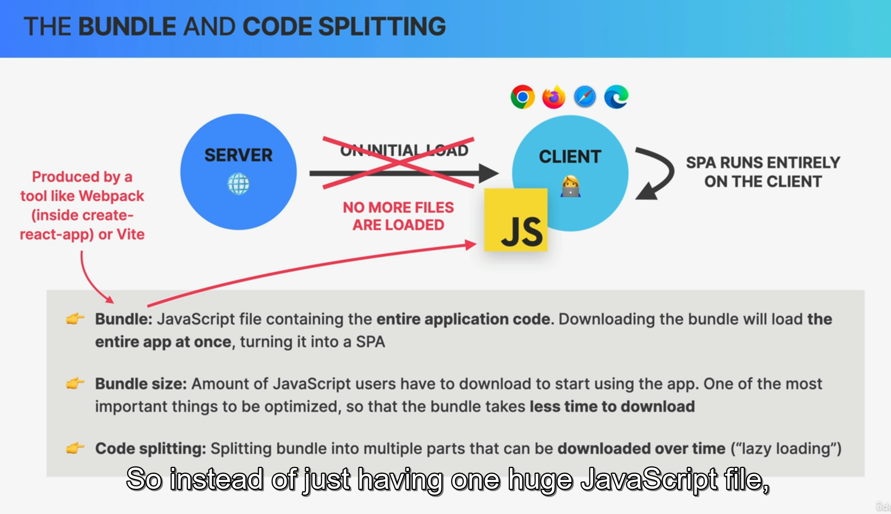
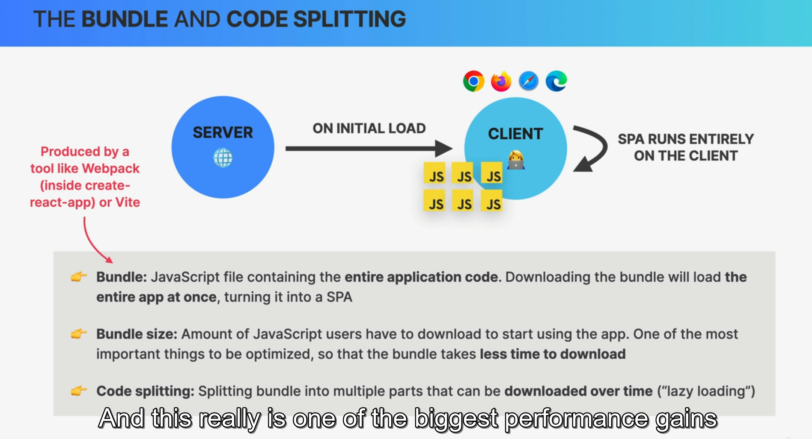
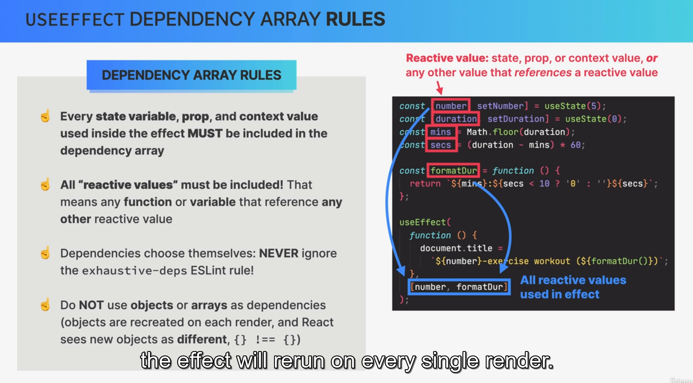
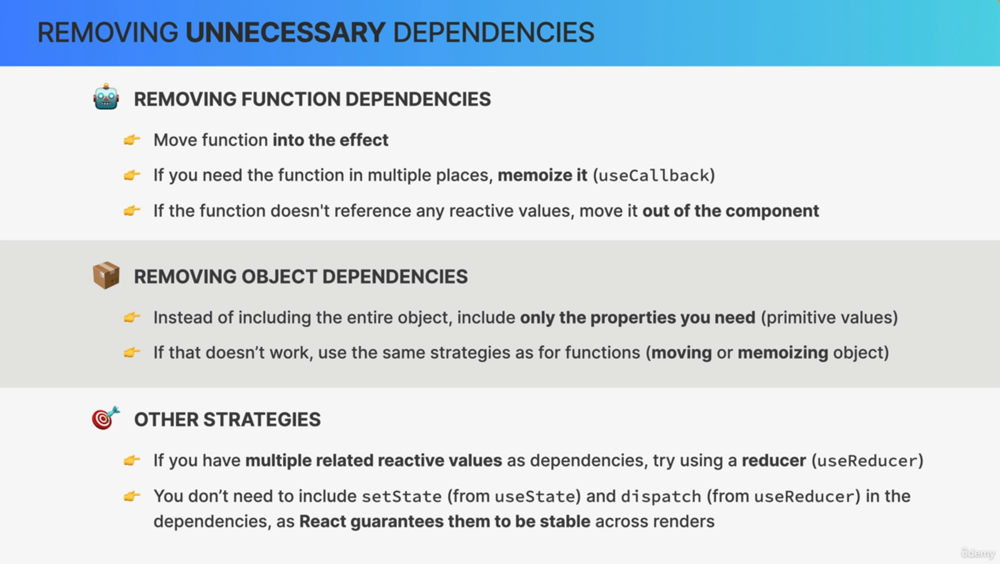
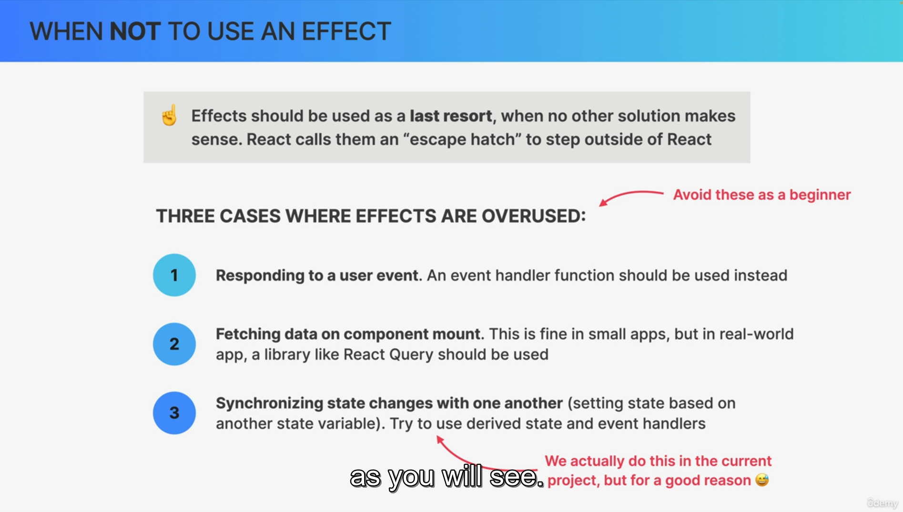

# How to create project using Vite

> npm create vite@4
> npm i
> To run:
> npm run dev

## how to add ESlint into project

1. install some packages as dev dependencies

> npm install eslint vite-plugin-eslint eslint-config-react-app --save-dev

2- create a file called .eslintrc.json and put this text to it:

```{
  "extends": "react-app"
}
```

3- config vite.config.js file by adding this to it:

```js
import { defineConfig } from "vite";
import react from "@vitejs/plugin-react";
import eslint from "vite-plugin-eslint";

// https://vitejs.dev/config/
export default defineConfig({
  plugins: [react(), eslint()],
});
```

# Routing

> it is client side routing and it handled by React Router package.
> it is used to make single page applications.
> Single Page application is good because there will never be a complete page reload.
> Makes the app natural.
> When URL changes,Dom will update. And react update the DOM.

# how to make a single page application

> We dont want hard refreshes,we want to move from one page to another.

```js
<Link to="/pricing">Pricing</Link>
```

# Styling options in React



> Css module: create one external css file per component

## how to define global classes

```js
.nav :global(.active) {
  background-color: green;
}

```

### compusing classes?

### Javascript way of writing a variable name in css

1- in css way:
Example: cta-link
2- JS way:(camelCase)
Example: ctaLink

# Route

## Outlet and index Route

> It is used to create nested routes
> Index is used make default route.

```js
<Route path="app" element={<AppLayout />}>
  <Route index element={<p>list of cities</p>} />
  <Route path="cities" element={<p>list of cities</p>} />
</Route>
```

```js
# re-render nested route
function Sidebar() {
  return (
    <div className={styles.sidebar}>
      <Logo />
      <AppNav />
      <Outlet />

    </div>
  );
}
```

# How to create a fake API

1. Install json server
   ` npm i json-server`
2. Add the below script into package.json file
   `    "server": "json-server --watch data/cities.json --port 8000 -delay 500"`
3. To run the server use:
   ` npm run server`

# State management using url

> Params: used to pass data to the next page
> Query string: to store global state that should be accessable everywhere.

## Params with react router

1. create a new route

   > The element that should be rendered when the url matches the path

```js
<Route path="cities/:id" element={<City />} />
```

2. link that to route
   > We create a link that we can move to the application page bt passing the id data

```
<Link className={styles.cityItem} to={`${id}`}>
```

3. In that route we read the state from URL
   > We read data from URL using useParams

```js
function City() {
const { id } = useParams();
return <h1>City {id}</h1>
```

## Read and set Query String

```js
     <Link
        className={styles.cityItem}
        to={`${id}?lat=${position.lat}&lng=${position.lng}`}
      >
```

```js
function Map() {
  const [searchParams, setSearchParams] = useSearchParams();
  const lat = searchParams.get("lat");
  const lng = searchParams.get("lng");
  return (
    <div className={styles.mapContainer}>
      <h1>Map</h1>
      <h1>
        Position:{lat},{lng}
      </h1>
    </div>
  );
}
```

# UseNavigate

```js
function Map() {
  const navigate = useNavigate();

  return (
    <div
      className={styles.mapContainer}
      onClick={() => {
        navigate("form");
      }}

    ></div>);
```

## navigate back

> -1 means to navigate 1 step back in browser history.

```js

   <Button type="back" onClick={(e) =>
  { e.preventDefault()
    navigate("-1")}}>
```

### Use navigate to redirect to a page

> declaritive way of using navigate

```js
<Route index element={<Navigate replace to={cities} />} />
```

> replace: replace the current element in the history stack

# React leaflet library

# htmlFor

> It is for in html and it will select the element with the id specified in the htmlFor.

```js
<label htmlFor="date">When did you go to {cityName}?</label>;
{
  /* <input
          id="date"
          onChange={(e) => setDate(e.target.value)}
          value={date}
        /> */
}
<DatePicker
  id="date"
  onChange={(date) => setDate(date)}
  selected={date}
  dateFormat={"dd/MM/yyyy"}
/>;
```

# Create a post request to an API

```js
const res = await fetch(`${BASE_URL}/cities`, {
  method: "POST",
  body: JSON.stringify(newCity),
  headers: {
    "Content-Type": "application/json",
  },
});
```

# Reeducer function

> reducer function is a pure function so we can
> not do API requests inside it,so we do fetch requests in seperate functions and after the data recieved we can dispatch actions to the reducer.
> When we have async code, we dont get that nice benefit wherewe can simply pass the dispatch function into the context value.

# Authentication Steps

1. Get users email and password from a login form and check with an API endpoint,if the password for given email is correct.

2. IF the info are correct,we then redirect the use to main application page and save the user object in our state.

3. protect application from unauthorized access who are not logged in.

# Bundle and code Splitting



## How to create js bundle

```
npm run build
```

## lazy loading



```js
const Homepage = lazy(() => import("./pages/Homepage"));
```

> To show loading Spinner before loading a new page,we can use React's suspense API.

```js
<Suspense fallback={<SpinnerFullPage />}></Suspense>
```

# UseEffect dependency array rules

> we shouldnt use objects in dependency array because react checks them with triple equality and js changes the refrence of objects in every render.
> 

## how to have objects in dependency array



## where not to use effect


